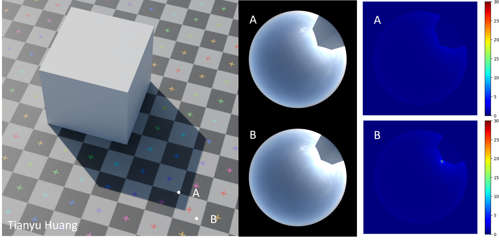
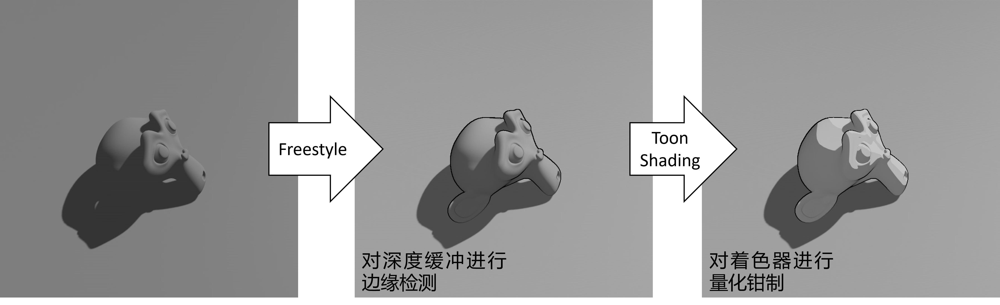
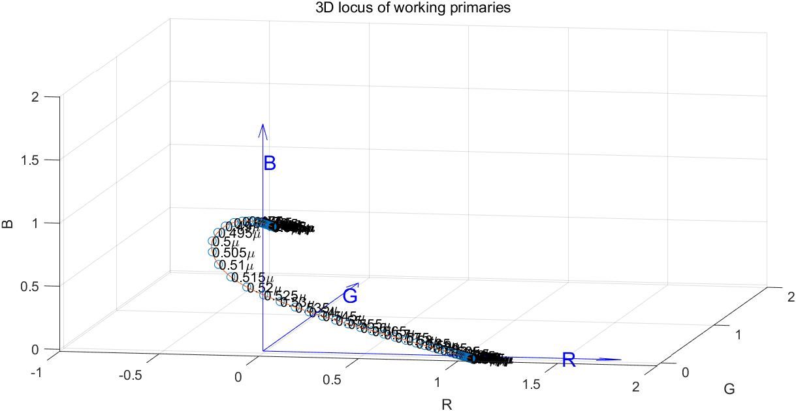
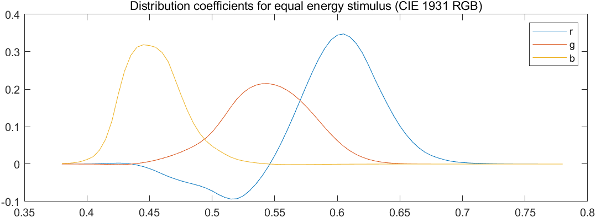
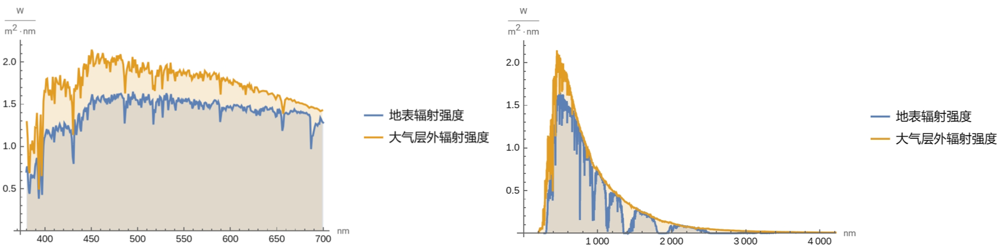

# (WIP) realtime-magic-supplement
This repository is the supplement material for the incoming lecture *Realtime Magic: Fundamentals*, including Matlab code, Mathematica code & Blender project files to generate figures in slides and some working examples.

这是《实时渲染魔法基础》的补充材料。包括插图的Matlab代码、Mathematica代码和Blender工程文件，以及一些可用示例。

## Project Structure
* `color`: 颜色相关插图，包括亮度曲线、颜色空间变换和locus可视化等等。
* `solar-radiation`: 太阳辐射光谱绘制。
* `volumetric`: 相函数插图的绘制。
* `npr`: 非真实感渲染插图。
* `path-tracing`: 路径追踪插图。
* `brdf`: 几个BRDF lobe插图。
* `lod`: LOD插图。

## License
MIT.

Copyright (c) 2024 Tianyu Huang, School of Software, Tsinghua University